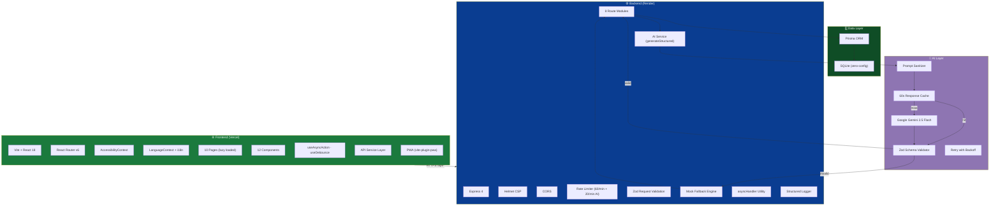

<p align="center">
  
</p>

<h1 align="center">
  <br>
  ⚽ GoalVerse AI
  <br>
  <sub>Where the Stadium Thinks Like a Team</sub>
</h1>

<p align="center">
  <strong>GenAI-powered stadium intelligence for FIFA World Cup 2026</strong><br>
  Navigation · Crowd Management · Accessibility · Sustainability · Multilingual Assistance · Operational Intelligence
</p>

<p align="center">
  <a href="https://goalverse-ai.vercel.app"></a>
  <a href="https://goalverse-ai.onrender.com/api/health"></a>
</p>

<p align="center">
  
  
  
  
  
  
  
  
  
  
  
  
</p>

---

## Table of Contents

- [Problem Statement](#-problem-statement)
- [Our Solution](#-our-solution)
- [Features](#-features)
- [GenAI Architecture](#-genai-architecture)
- [System Architecture](#-system-architecture)
- [Folder Structure](#-folder-structure)
- [Tech Stack](#-tech-stack)
- [API Documentation](#-api-documentation)
- [Database Schema](#-database-schema)
- [Security](#-security)
- [Accessibility](#-accessibility)
- [Performance](#-performance)
- [Testing](#-testing)
- [Problem Statement Alignment](#-problem-statement-alignment)
- [Judging Criteria Mapping](#-judging-criteria-mapping)
- [Why We Stand Out](#-why-we-stand-out)
- [Future Scope](#-future-scope)
- [Installation](#-installation)
- [Deployment](#-deployment)
- [Team](#-team)

---

## 🏟️ Problem Statement

### The Challenge

**FIFA World Cup 2026** will be the largest sporting event in history — **48 teams, 104 matches, 16 venues across 3 countries**. Stadiums seating 60,000–100,000 fans each match day create operational challenges that static apps simply cannot address:

| Pain Point | Scale |
|---|---|
| Fan navigation inside unfamiliar mega-venues | 100,000+ people, zero indoor GPS |
| Gate overcrowding and stampede risk | 6+ entry points, surge arrivals 90 min pre-kickoff |
| Language barriers among global fans | 200+ nationalities, 6+ major languages |
| Accessibility gaps for fans with disabilities | Wheelchair routes, quiet zones, sensory needs |
| Match-day logistics for first-time attendees | Transport, timing, seat-finding, exit planning |
| Sustainability targets for FIFA Green Goal | CO₂ tracking, transport incentives |
| Volunteer & organizer situational awareness | Real-time incident triage, staffing optimization |

### Why Existing Stadium Apps Fail

Traditional stadium apps are **static brochure-ware**: fixed maps, predetermined FAQs, and generic notifications. They cannot:

- Understand a fan's natural-language question ("Where's the nearest halal food near Gate 3?")
- Predict crowd surges and recommend alternate gates in real time
- Generate personalized match-day itineraries based on seat, transport, and party size
- Auto-detect a fan's language and translate on the fly
- Synthesize live incident data into actionable intelligence for organizers

### Why GenAI Is Required

These problems require **understanding**, **reasoning**, and **generation** — not lookup tables. A fan's question at Gate 4 is different from the same question at Gate 1. A crowd advisory at 65% density needs different language than at 90%. An itinerary for a solo metro rider is different from a family of five driving. Only Generative AI can produce contextual, personalized, real-time responses at the scale FIFA World Cup 2026 demands.

---

## 💡 Our Solution

### GoalVerse AI — The Living Stadium

GoalVerse AI transforms a passive stadium into an **intelligent, responsive organism** that thinks, speaks, and acts like a well-coordinated team. Every feature is framed around football itself — goals, plays, referee cards, pitch markings — because the best technology disappears into the experience it serves.

**Vision**: A world where every fan, regardless of language, ability, or familiarity, feels like the stadium was built just for them.

**Mission**: Deliver AI-powered stadium intelligence that is secure, accessible, multilingual, and deployable at zero infrastructure cost.

### What Makes It Unique

| Differentiator | How We Deliver It |
|---|---|
| **Fail-safe AI architecture** | Every Gemini call has a Zod-validated schema, a deterministic mock fallback, retry with backoff, and response caching — the app never breaks, even without an API key |
| **Football-native UX** | Referee card metaphors, pitch backgrounds, corner flags, scoreboard headers — not generic Material UI |
| **Zero-cost deployment** | SQLite (no database server), free Render + Vercel tiers, optional Gemini key |
| **Security-first** | Prompt injection sanitization, Helmet CSP, rate limiting, input validation on every endpoint |
| **Accessibility-first** | Skip links, ARIA landmarks, focus management, high-contrast mode, reduced motion, font scaling, RTL support, axe-core automated testing |
| **Multilingual from day one** | 6-language UI chrome (EN, HI, ES, FR, PT, AR) + AI-powered free-text translation |

---

## ✨ Features

### 🏠 Home — The Field

**What it does**: A dashboard presenting all 8 feature modules as "goal cards" — each one a play the fan can walk toward.

**How it works**: Renders `GoalCard` components as real `<Link>` elements (not `div+onClick`) for full keyboard and screen-reader operability. Cards are wrapped in `React.memo` to avoid unnecessary re-renders on language switching.

**Who benefits**: Every fan arriving at the app for the first time.

**AI involvement**: None on this page — it's the launchpad.

---

### 🧭 Navigator — AI Stadium Wayfinding

**What it does**: Fans type a natural-language question — *"Where's my seat?"*, *"Nearest halal food?"*, *"I need wheelchair access"* — and receive step-by-step walking directions, estimated time, and accessibility notes.

**How it works**:
- Input is **debounced** (500ms via `useDebounce` hook) to prevent firing an AI request on every keystroke
- The query and starting gate are **sanitized** (`sanitizePromptInput`) to neutralize prompt injection
- Gemini receives a structured prompt and must return JSON matching `NavigatorResponseSchema` (destination, summary, steps[], estimatedMinutes, accessibilityNote)
- Response is **validated with Zod** — malformed AI output falls back to the deterministic mock
- Example quick-search buttons ("Nearest washroom", "I need wheelchair access") lower the barrier to entry

**Who benefits**: Fans navigating unfamiliar mega-venues, especially those with mobility needs.

**AI involvement**: `POST /api/navigator/query` → Gemini generates contextual walking directions.

---

### 📊 Crowd Watch — Live Gate Density & AI Advisory

**What it does**: Displays live crowd density for every stadium gate using the referee's **card metaphor** (🟢 green → 🟡 yellow → 🟠 orange → 🔴 red), with an AI "coach's advice" button for congested gates.

**How it works**:
- `GET /api/crowd/gates` returns per-gate density, updated every 30 seconds via a pseudo-random simulation seeded by the current minute (deterministic for reviewers)
- Per-gate `MatchCard` components are color-coded by density level with **WCAG AA-compliant contrast** (the code documents a specific fix: `bg-cheer-orangeDark` at 4.75:1 instead of `bg-cheer-orange` at 2.79:1)
- "Get coach's advice" triggers `POST /api/crowd/advice` → Gemini returns a football-coach-tone recommendation with alternate gate and estimated minutes saved

**Who benefits**: Fans avoiding overcrowded gates; organizers monitoring flow.

**AI involvement**: Gemini generates coach-style crowd advisories with alternate routing.

---

### 📋 Match Planner — Personalized Match-Day Itinerary

**What it does**: Generates a complete match-day timeline from departure to post-match exit, personalized by match, seat section, party size, and transport mode.

**How it works**:
- 6-field form validated with Zod (`PlanSchema`): ownerName, matchName, seatSection, arrivalTime, companions (1–20), transportMode (walk/metro/bus/rideshare/bike/car)
- `POST /api/planner/itinerary` generates timeline entries relative to kickoff (e.g., "-02:30", "00:00", "+02:15") plus transport and weather tips
- The generated plan is **persisted to the database** (`prisma.itinerary.create`) for retrieval via `GET /api/planner/itinerary/:id`
- Caching is **deliberately disabled** for itineraries (`useCache: false`) because they're personalized

**Who benefits**: First-time World Cup attendees, families, groups.

**AI involvement**: Gemini generates context-aware timelines, transport tips, and weather advice.

---

### 🌐 Multilingual Assistant — AI Translation

**What it does**: Fans type text in any language, select a target language, and receive an auto-detected translation — bridging the gap between fans and staff who don't share a language.

**How it works**:
- Supports 6 languages: English, हिन्दी, Español, Français, Português, العربية
- `POST /api/multilingual/translate` sends text + targetLang to Gemini with a structured prompt
- Gemini auto-detects the source language and returns `{detectedLanguage, translatedText, targetLanguage}`
- This is **separate from the static UI translations** (`i18n/translations.ts`), which are pre-translated interface chrome that works offline

**Who benefits**: International fans communicating with staff, volunteers, and each other.

**AI involvement**: Gemini performs real-time language detection and translation.

---

### ♿ Accessibility — Inclusive Stadium Experience

**What it does**: Two functions in one page:
1. **Accessibility Settings Panel**: High-contrast mode, dark mode, reduced motion, and font scaling (85%–150%)
2. **Step-Free Route Finder**: AI-generated wheelchair-friendly routes with nearby accessible facilities

**How it works**:
- `AccessibilityContext` persists settings to `localStorage` and applies CSS classes (`high-contrast`, `reduce-motion`, `dark`) to `<html>`
- Font scaling uses a CSS custom property (`--font-scale`) applied at `html { font-size: calc(16px * var(--font-scale)) }`
- Route finder: `POST /api/accessibility/route` → Gemini generates step-free paths with relevant facilities (wheelchair charging, quiet zones, accessible washrooms)
- Facility data comes from `GET /api/accessibility/facilities` querying `PointOfInterest` filtered by category

**Who benefits**: Fans with wheelchairs, mobility impairments, sensory sensitivities, visual impairments.

**AI involvement**: Gemini generates personalized accessible routes based on stated needs.

---

### 🌱 Eco Score — Sustainability & Green Goal Tracking

**What it does**: Fans log their transport mode and see CO₂ saved, a gamified "Green Goal" progress bar, and AI encouragement.

**How it works**:
- 6 transport modes (walk, bike, metro, bus, rideshare, car) with one-tap logging
- `POST /api/eco/log` → Gemini estimates CO₂ savings vs. driving alone, returns a gamified suggestion
- Each log is **persisted** (`prisma.ecoLog.create`) for per-user cumulative tracking via `GET /api/eco/summary/:userAlias`
- Progress bar uses proper `role="progressbar"` with `aria-valuenow`, `aria-valuemin`, `aria-valuemax`

**Who benefits**: Environmentally conscious fans; FIFA Green Goal reporting.

**AI involvement**: Gemini generates personalized sustainability suggestions and CO₂ calculations.

---

### 🙋 Volunteer Desk — Incident & Lost/Found Management

**What it does**: Three functions:
1. **AI Operations Summary**: Real-time synthesis of open incidents and lost/found reports with priority actions
2. **Lost & Found Reporting**: Submit and track lost items
3. **Incident Reporting**: Log medical, crowd, security, and facilities incidents with severity levels

**How it works**:
- Summary: `GET /api/volunteer/summary` counts open incidents and lost/found reports, sends counts to Gemini, returns actionable priority list
- Lost/Found: `POST /api/volunteer/lost-found` persists to `LostFoundReport` model; text is sanitized before storage
- Incidents: `POST /api/volunteer/incidents` persists to `IncidentReport` with type (medical/crowd/security/facilities), severity (low/medium/high), zone, and description

**Who benefits**: Volunteers, coordinators, safety teams.

**AI involvement**: Gemini synthesizes operational data into prioritized action items.

---

### 🎯 Control Room — Organizer Operational Intelligence

**What it does**: A command-center dashboard for venue organizers with AI-generated summaries, peak predictions, staffing suggestions, and trend analysis.

**How it works**:
- `GET /api/organizer/insight` fetches the 20 most recent crowd readings and total incident count, sends to Gemini for analysis
- Returns: summary, peak prediction ("45 min before kickoff"), staffing suggestion ("add 2 stewards to North gate"), trends array
- `GET /api/organizer/incidents` returns the 100 most recent incidents in a data table with scope headers, caption, and semantic markup

**Who benefits**: Venue operations managers, FIFA organizers, safety officers.

**AI involvement**: Gemini generates operational intelligence from live crowd and incident data.

---

## 🧠 GenAI Architecture

### Design Philosophy

Every AI interaction in GoalVerse AI follows a **single integration point**: the `generateStructured<T>()` function in [`server/src/services/ai.ts`](server/src/services/ai.ts). This is not a thin wrapper — it's a complete AI safety pipeline:

```
Fan Input → Sanitize → Prompt Build → Cache Check → Gemini API (with retry)
                                                          ↓
                                              JSON.parse → Zod Validate
                                                          ↓
                                               Pass? → Return typed data
                                               Fail? → Return mock fallback
```

### Prompt Engineering

Every prompt follows a strict pattern:

```
1. Role assignment    → "You are a stadium navigation assistant for FIFA World Cup 2026"
2. Context injection  → Sanitized user input interpolated into the prompt
3. Output contract    → "Respond ONLY with JSON matching this shape: {...}"
4. Tone guidance      → "Use an encouraging, football-coach tone"
5. Constraint         → "Keep steps to 3-5 short, concrete walking directions"
```

All 8 AI endpoints use this pattern. Prompts are defined inline with their routes for auditability — no hidden prompt files.

### Structured Outputs & Schema Validation

| Schema | Defined In | Fields |
|---|---|---|
| `NavigatorResponseSchema` | `types/schemas.ts` | destination, summary, steps[], estimatedMinutes, accessibilityNote? |
| `CrowdAdviceSchema` | `types/schemas.ts` | headline, recommendation, alternateGate, estimatedMinutesSaved |
| `ItineraryPlanSchema` | `types/schemas.ts` | title, timeline[{time, activity, note?}], transportTip, weatherTip |
| `TranslationResponseSchema` | `types/schemas.ts` | detectedLanguage, translatedText, targetLanguage |
| `AccessibilityRouteSchema` | `types/schemas.ts` | route[], facilities[], summary |
| `EcoSuggestionSchema` | `types/schemas.ts` | suggestion, co2SavedKg, greenGoalProgress (0–100) |
| `VolunteerSummarySchema` | `types/schemas.ts` | summary, priorityActions[], openIncidents |
| `OrganizerInsightSchema` | `types/schemas.ts` | summary, peakPrediction, staffingSuggestion, trends[] |

Every schema is a **Zod object** — the same library used for input validation. If Gemini returns JSON that fails `.safeParse()`, the response is discarded and the mock fallback is used. The client never receives unvalidated AI output.

### Fallback Strategy

```typescript
// From server/src/services/ai.ts
if (!API_KEY) {
  return { data: mockFn(), source: 'mock' };
}
// ... if Gemini returns malformed JSON:
if (!parsed.success) {
  return { data: mockFn(), source: 'mock' };
}
// ... if Gemini throws (network error, 500, etc.):
catch (err) {
  return { data: mockFn(), source: "mock" };
}
```

Mock functions in [`server/src/services/mocks.ts`](server/src/services/mocks.ts) are:
- **Honest**: They don't pretend to be AI. The mock translator says `[Spanish translation unavailable offline]`.
- **Deterministic**: Same input always produces the same output.
- **Rule-based**: They contain real logic (e.g., `mockNavigator` checks for "wheelchair", "halal", "washroom" keywords).
- **Schema-compliant**: They return the exact same type `T` the Zod schema expects.

Every API response includes `aiSource: 'gemini' | 'mock'` so the frontend (and judges) know which path generated the data.

### AI Safety & Prompt Injection Prevention

The `sanitizePromptInput()` function applies four layers of defense:

```typescript
// 1. Length cap — prevents prompt stuffing
.slice(0, maxLen)

// 2. Control character removal — blocks escape sequences
.replace(/[\u0000-\u001F\u007F]/g, ' ')

// 3. Fence breakout neutralization — prevents code block injection
.replace(/```/g, "'''")

// 4. Instruction override filtering — catches common prompt injection phrases
.replace(/\b(ignore|disregard)\s+(all|previous|prior)\s+instructions?\b/gi, '[filtered]')
```

This function is called on **every** piece of user-provided text before it enters a prompt. It is tested in [`server/src/tests/ai.test.ts`](server/src/tests/ai.test.ts) with explicit test cases for each vector.

### Response Caching

`generateStructured` caches validated responses for 60 seconds (`CACHE_TTL_MS = 60_000`), keyed by `schemaName::prompt`. This:
- Cuts Gemini API costs for identical requests
- Reduces latency for repeat queries
- Can be disabled per-endpoint (`useCache: false` for personalized itineraries)

### Retry with Backoff

Network failures and 429/5xx responses are retried up to 2 times with exponential backoff (`350ms × 2^attempt`). Non-retryable errors (4xx other than 429) fail immediately to the mock.

### Gemini Integration

- **Model**: `gemini-2.5-flash` (configurable via `GEMINI_MODEL` env var)
- **API**: Google AI Studio REST endpoint (`generativelanguage.googleapis.com/v1beta`)
- **Config**: `temperature: 0.4` (low for structured output reliability), `responseMimeType: 'application/json'`

---

## 🏗️ System Architecture



---

## 📁 Folder Structure

```
goalverse-ai/
├── client/                          # React 18 + Vite frontend
│   ├── index.html                   # Entry HTML with CSP meta tag, Google Fonts, SEO meta
│   ├── vite.config.ts               # Vite config + PWA plugin + API proxy
│   ├── tailwind.config.js           # Football-themed design tokens (pitch, trophy, penalty, etc.)
│   ├── tsconfig.json                # Strict TypeScript config
│   ├── src/
│   │   ├── main.tsx                 # React root with StrictMode + BrowserRouter
│   │   ├── App.tsx                  # Shell: SkipLink, ScoreboardHeader, Nav, lazy Routes, focus management
│   │   ├── index.css                # Global styles: focus rings, skip link, high-contrast, reduced motion
│   │   ├── pages/
│   │   │   ├── Home.tsx             # Dashboard with 8 GoalCard links
│   │   │   ├── Navigator.tsx        # AI wayfinding with debounce + example queries
│   │   │   ├── CrowdHeatmap.tsx     # Live gate density + AI coach advice
│   │   │   ├── MatchPlanner.tsx     # 6-field form → AI itinerary
│   │   │   ├── Translate.tsx        # Free-text AI translation (6 languages)
│   │   │   ├── AccessibilityPage.tsx# Settings panel + AI route finder
│   │   │   ├── EcoScore.tsx         # Transport logging + AI Green Goal
│   │   │   ├── VolunteerDashboard.tsx# Incident + lost/found + AI summary
│   │   │   ├── OrganizerDashboard.tsx# AI operational intelligence + incident table
│   │   │   └── NotFound.tsx         # Football-themed "offside" 404
│   │   ├── components/
│   │   │   ├── ScoreboardHeader.tsx  # App header (SVG logo, tagline, language switcher)
│   │   │   ├── Nav.tsx              # Translated navigation bar with NavLink active states
│   │   │   ├── SkipLink.tsx         # "Skip to main content" a11y link
│   │   │   ├── GoalCard.tsx         # Feature card (memo'd, keyboard-operable Link)
│   │   │   ├── MatchCard.tsx        # Crowd density card (referee card metaphor, memo'd)
│   │   │   ├── AccessibilityPanel.tsx# Settings: contrast, motion, dark mode, font scale
│   │   │   ├── LanguageSwitcher.tsx  # 6-language dropdown in header
│   │   │   ├── PitchBackground.tsx  # Full football pitch SVG backdrop
│   │   │   ├── CornerFlag.tsx       # Decorative corner flag SVG motifs
│   │   │   ├── IncidentForm.tsx     # Incident report form (standalone)
│   │   │   ├── LostFoundForm.tsx    # Lost & found form (standalone)
│   │   │   └── OperationsSummary.tsx# AI volunteer summary card
│   │   ├── hooks/
│   │   │   ├── useAsyncAction.ts    # Generic async action state management
│   │   │   └── useDebounce.ts       # Input debouncing for AI calls
│   │   ├── services/
│   │   │   └── api.ts               # Typed API client (ApiError class, request helper)
│   │   ├── context/
│   │   │   ├── AccessibilityContext.tsx # Global a11y settings (localStorage persistence)
│   │   │   └── LanguageContext.tsx   # i18n context (browser detection, RTL, localStorage)
│   │   ├── i18n/
│   │   │   └── translations.ts      # 6-language UI strings + RTL detection
│   │   ├── types/
│   │   │   ├── api.ts               # TypeScript interfaces for all API responses
│   │   │   └── jest-axe.d.ts        # Type declarations for axe a11y testing
│   │   └── tests/                   # 12 test files (see Testing section)
│   └── public/                      # Static assets (favicon, PWA icons)
│
├── server/                          # Express 4 + TypeScript backend
│   ├── package.json                 # Dependencies: express, prisma, zod, helmet, cors, rate-limit
│   ├── tsconfig.json                # Strict TypeScript config
│   ├── vitest.config.ts             # Test config with V8 coverage
│   ├── prisma/
│   │   ├── schema.prisma            # 7 models: Gate, PointOfInterest, CrowdReading, etc.
│   │   ├── seed.ts                  # Seeds 6 gates + 9 POIs + initial crowd readings
│   │   ├── dev.db                   # Development SQLite database
│   │   └── test.db                  # Test-isolated SQLite database
│   ├── src/
│   │   ├── index.ts                 # Server entry: port binding, Gemini key detection
│   │   ├── app.ts                   # Express app factory (testable without port binding)
│   │   ├── routes/
│   │   │   ├── navigator.ts         # POST /query — AI wayfinding
│   │   │   ├── crowd.ts             # GET /gates + POST /advice — live density + AI advisory
│   │   │   ├── planner.ts           # POST /itinerary + GET /:id — AI itinerary + persistence
│   │   │   ├── multilingual.ts      # POST /translate + GET /languages — AI translation
│   │   │   ├── accessibility.ts     # GET /facilities + POST /route — facility data + AI routing
│   │   │   ├── eco.ts               # POST /log + GET /summary — AI eco + persistence
│   │   │   ├── volunteer.ts         # POST /lost-found, /incidents + GET /summary — CRUD + AI
│   │   │   └── organizer.ts         # GET /insight + /incidents — AI ops intelligence
│   │   ├── services/
│   │   │   ├── ai.ts                # generateStructured: Gemini integration, cache, retry, sanitize
│   │   │   └── mocks.ts             # 8 deterministic mock functions (honest fallbacks)
│   │   ├── middleware/
│   │   │   ├── security.ts          # Helmet, CORS, rate limiters (general + AI-specific)
│   │   │   └── validate.ts          # validateBody, validateQuery, errorHandler, notFoundHandler
│   │   ├── db/
│   │   │   └── prisma.ts            # Singleton PrismaClient (hot-reload safe)
│   │   ├── utils/
│   │   │   ├── asyncHandler.ts      # Express async error wrapper
│   │   │   └── logger.ts            # Structured logger (no-console lint safe)
│   │   ├── types/
│   │   │   └── schemas.ts           # 8 Zod schemas for AI response validation
│   │   └── tests/                   # 12 test files (see Testing section)
│
├── package.json                     # Workspace root (npm workspaces)
├── vercel.json                      # Vercel: SPA rewrites + security headers
├── .prettierrc.json                 # Code formatting rules
└── .gitignore                       # Node, build, env exclusions
```

---

## 🛠️ Tech Stack

| Layer | Technology | Why |
|---|---|---|
| **Frontend Framework** | React 18 + TypeScript | Component model, hooks ecosystem, strict typing |
| **Build Tool** | Vite 5 | Sub-second HMR, optimized production builds, native ESM |
| **Styling** | Tailwind CSS 3 | Utility-first with custom football design tokens |
| **Routing** | React Router v6 | Client-side navigation with lazy loading |
| **PWA** | vite-plugin-pwa (Workbox) | Offline API caching, installability, `NetworkFirst` strategy |
| **Backend** | Express 4 + TypeScript | Lightweight, testable, factory-pattern app |
| **Database** | SQLite via Prisma 5 | Zero-config, zero-cost, serverless-compatible |
| **ORM** | Prisma Client | Type-safe queries, migrations, seeding |
| **AI** | Google Gemini 2.5 Flash | Fast structured JSON generation, low cost |
| **Validation** | Zod 3 | Shared schema definition for input AND AI output validation |
| **Security** | Helmet + CORS + express-rate-limit | CSP, CORS, rate limiting out of the box |
| **Testing** | Vitest + Testing Library + Supertest + jest-axe | Unit, integration, a11y, API testing |
| **Code Quality** | ESLint + Prettier + TypeScript strict mode | Consistent style, caught errors, no-console enforcement |
| **Deployment** | Vercel (frontend) + Render (backend) | Free tiers, zero-config, global CDN |

---

## 📡 API Documentation

### Health Check

| Method | Endpoint | Purpose |
|---|---|---|
| `GET` | `/api/health` | Server liveness probe |

**Response**: `{ "status": "ok", "service": "goalverse-ai-server", "time": "ISO-8601" }`

---

### Navigator

| Method | Endpoint | Purpose | Rate Limited |
|---|---|---|---|
| `POST` | `/api/navigator/query` | AI-powered wayfinding | ✅ (20/min) |

**Request Body**:
```json
{
  "query": "Nearest halal food",      // string, 2–300 chars
  "fromGate": "Gate 1"                // string, 1–60 chars, default "Gate 1"
}
```

**Response**:
```json
{
  "destination": "Halal Food Court (East Concourse)",
  "summary": "From Gate 1, the fastest path avoids the main concourse crowd.",
  "steps": ["Exit Gate 1 and turn toward the concourse ring", "Follow the green decals", "Arrive at Halal Food Court"],
  "estimatedMinutes": 6,
  "accessibilityNote": null,
  "aiSource": "gemini"
}
```

---

### Crowd

| Method | Endpoint | Purpose | Rate Limited |
|---|---|---|---|
| `GET` | `/api/crowd/gates` | Live gate density (all gates) | ❌ |
| `POST` | `/api/crowd/advice` | AI crowd advisory for a gate | ✅ (20/min) |

**GET /api/crowd/gates Response**:
```json
{
  "gates": [
    { "id": "cuid", "name": "Gate 1", "zone": "North", "capacity": 8000, "wheelchairAccessible": true, "density": 0.73, "level": "orange" }
  ]
}
```

**POST /api/crowd/advice Request**:
```json
{ "gateName": "Gate 1", "density": 0.73 }
```

**Response**:
```json
{
  "headline": "Gate 1 is overloaded (orange card)",
  "recommendation": "Switch to Gate 2 to avoid the crowd build-up.",
  "alternateGate": "Gate 2",
  "estimatedMinutesSaved": 15,
  "level": "orange",
  "aiSource": "gemini"
}
```

---

### Planner

| Method | Endpoint | Purpose | Rate Limited |
|---|---|---|---|
| `POST` | `/api/planner/itinerary` | Generate & persist AI itinerary | ✅ (20/min) |
| `GET` | `/api/planner/itinerary/:id` | Retrieve saved itinerary | ❌ |

**POST Request**:
```json
{
  "ownerName": "Aditi",
  "matchName": "Group Stage: Brazil vs Argentina",
  "seatSection": "Section 114, Row F",
  "arrivalTime": "2026-06-15T18:00:00Z",
  "companions": 3,
  "transportMode": "metro"
}
```

**Response** (201):
```json
{
  "id": "cuid",
  "title": "Match Day Plan: Group Stage: Brazil vs Argentina",
  "timeline": [
    { "time": "-02:30", "activity": "Depart via metro", "note": "Buffer for security lines" },
    { "time": "-01:00", "activity": "Arrive at stadium, clear security & bag check" },
    { "time": "-00:30", "activity": "Head to Section 114, Row F", "note": "Party of 3" },
    { "time": "00:00", "activity": "Kickoff" },
    { "time": "+02:15", "activity": "Post-match exit via least-crowded gate" }
  ],
  "transportTip": "Metro platforms get congested for 45 min post-match.",
  "weatherTip": "Check the forecast the morning of the match.",
  "aiSource": "gemini"
}
```

---

### Multilingual

| Method | Endpoint | Purpose | Rate Limited |
|---|---|---|---|
| `POST` | `/api/multilingual/translate` | AI language detection + translation | ✅ (20/min) |
| `GET` | `/api/multilingual/languages` | List supported languages | ❌ |

**POST Request**:
```json
{ "text": "¿Dónde está la entrada accesible?", "targetLang": "en" }
```

**Response**:
```json
{
  "detectedLanguage": "es",
  "translatedText": "Where is the accessible entrance?",
  "targetLanguage": "en",
  "aiSource": "gemini"
}
```

---

### Accessibility

| Method | Endpoint | Purpose | Rate Limited |
|---|---|---|---|
| `GET` | `/api/accessibility/facilities` | List accessible facilities (quiet zones, medical, etc.) | ❌ |
| `POST` | `/api/accessibility/route` | AI step-free route generation | ✅ (20/min) |

**POST Request**: `{ "need": "I use a wheelchair and need to reach Section 114" }`

**Response**:
```json
{
  "route": ["Main Gate", "Step-free ramp", "Accessible concourse", "Designated seating"],
  "facilities": ["Wheelchair charging point", "Quiet zone nearby", "Accessible washroom"],
  "summary": "Step-free route generated for: wheelchair access to Section 114",
  "aiSource": "gemini"
}
```

---

### Eco Score

| Method | Endpoint | Purpose | Rate Limited |
|---|---|---|---|
| `POST` | `/api/eco/log` | Log transport + get AI eco suggestion | ✅ (20/min) |
| `GET` | `/api/eco/summary/:userAlias` | Cumulative CO₂ savings for a user | ❌ |

**POST Request**: `{ "userAlias": "aditi-fan", "transportMode": "metro" }`

**Response** (201):
```json
{
  "suggestion": "Great choice — metro is one of the greenest ways to reach the stadium.",
  "co2SavedKg": 1.5,
  "greenGoalProgress": 60,
  "aiSource": "gemini"
}
```

---

### Volunteer

| Method | Endpoint | Purpose | Rate Limited |
|---|---|---|---|
| `POST` | `/api/volunteer/lost-found` | Report a lost/found item | ❌ |
| `GET` | `/api/volunteer/lost-found` | List all lost/found reports | ❌ |
| `POST` | `/api/volunteer/incidents` | Report an incident | ❌ |
| `GET` | `/api/volunteer/summary` | AI-generated operations summary | ✅ (20/min) |

---

### Organizer

| Method | Endpoint | Purpose | Rate Limited |
|---|---|---|---|
| `GET` | `/api/organizer/insight` | AI operational intelligence | ✅ (20/min) |
| `GET` | `/api/organizer/incidents` | List recent incidents | ❌ |

---

## 🗃️ Database Schema

7 Prisma models in [`server/prisma/schema.prisma`](server/prisma/schema.prisma):

| Model | Purpose | Key Fields |
|---|---|---|
| **Gate** | Stadium entry points | name (unique), zone, capacity, wheelchairAccessible |
| **PointOfInterest** | Facilities (washrooms, food, medical, quiet zones) | name, category, zone, x/y coordinates, halal, wheelchairAccessible |
| **CrowdReading** | Historical gate density snapshots | gateId (FK → Gate), density (0.0–1.0), level (green/yellow/orange/red) |
| **Itinerary** | Persisted AI-generated match-day plans | ownerName, matchName, seatSection, transportMode, planJson |
| **LostFoundReport** | Lost & found item tracking | itemDesc, location, status (open/matched/closed), reportedBy |
| **IncidentReport** | Safety incident logging | type (medical/crowd/security/facilities), severity (low/medium/high), zone, description, status |
| **EcoLog** | Per-fan sustainability tracking | userAlias, transportMode, co2SavedKg |

**Database**: SQLite — deliberately chosen for zero-cost, zero-config deployment. No Docker, no database server, no connection pooling. The Prisma singleton pattern prevents connection exhaustion during hot-reload.

---

## 🔒 Security

| Layer | Implementation | Why It Exists |
|---|---|---|
| **Helmet** | Full CSP directives (default-src 'self', script-src 'self', frame-ancestors 'none', etc.) | Prevents XSS, clickjacking, MIME sniffing, and unauthorized resource loading |
| **Client-side CSP** | `<meta http-equiv="Content-Security-Policy">` in `index.html` | The HTML document is served by Vercel, not Express — Helmet headers only protect API responses, not the page itself |
| **Vercel Security Headers** | `X-Content-Type-Options: nosniff`, `X-Frame-Options: DENY`, `Referrer-Policy: strict-origin-when-cross-origin`, `Permissions-Policy: camera=(), microphone=(), geolocation=()` | Defense-in-depth for the static frontend deployment |
| **CORS** | Restricted to `CLIENT_ORIGIN` env var | Prevents unauthorized cross-origin API access |
| **General Rate Limiting** | 60 requests/minute per IP | Blunts scraping and DoS attempts |
| **AI Rate Limiting** | 20 requests/minute per IP on AI endpoints | Protects the most expensive backend operation (Gemini API calls) |
| **Input Validation** | Zod schemas on every `POST` endpoint (`validateBody` middleware) | Rejects malformed requests before they reach business logic |
| **Prompt Sanitization** | `sanitizePromptInput()`: length cap, control char removal, fence breakout neutralization, injection phrase filtering | Prevents prompt injection attacks from free-text user input |
| **Schema Validation of AI Output** | Zod `.safeParse()` on every Gemini response | Ensures the client never receives malformed or hallucinated AI output |
| **Safe Error Handling** | `errorHandler` returns generic message, logs details server-side only | Never leaks stack traces, file paths, or internal error messages to clients |
| **JSON Body Limit** | `express.json({ limit: '50kb' })` | Prevents request body bombing (this API has no file uploads) |
| **x-powered-by Disabled** | `app.disable('x-powered-by')` | Removes the Express fingerprint header |

---

## ♿ Accessibility

### WCAG 2.1 AA Compliance

| Feature | Implementation | Code Location |
|---|---|---|
| **Skip Link** | `<a href="#main-content" class="skip-link">` — invisible until focused, then visible at top of page | `components/SkipLink.tsx`, `index.css` |
| **Focus Management** | `useRouteChangeAnnouncement` hook moves focus to `<main>` on every SPA route change, with `tabIndex={-1}` | `App.tsx` L45–56 |
| **ARIA Landmarks** | `<nav aria-label="Primary">`, `<main id="main-content">`, `<section aria-labelledby="...">` throughout | Every page and component |
| **ARIA Live Regions** | `aria-live="polite"` on all AI response containers, `role="alert"` on error messages, `role="status"` on success messages and crowd cards | All pages |
| **Semantic HTML** | Single `<h1>` per page, heading hierarchy, `<ol>` for ordered steps, `<table>` with `<caption>`, `<th scope="col">` | Throughout |
| **Keyboard Navigation** | All interactive elements are real `<a>`, `<button>`, `<input>`, `<select>` — no `div+onClick` | GoalCard uses `<Link>`, MatchCard uses `<button>` |
| **Visible Focus Rings** | `:focus-visible { outline: 3px solid trophy.gold; outline-offset: 2px }` — never suppressed | `index.css` L27–31 |
| **High-Contrast Mode** | Pure black/white/yellow theme via `.high-contrast` class on `<html>` | `AccessibilityContext.tsx`, `index.css` |
| **Reduced Motion** | Respects both `prefers-reduced-motion: reduce` media query AND manual toggle | `index.css` L56–72 |
| **Dark Mode** | Class-based dark mode with `color-scheme: dark` | `AccessibilityContext.tsx`, `index.css` |
| **Font Scaling** | CSS custom property `--font-scale` (85%–150%) with +/−/Reset controls | `AccessibilityContext.tsx`, `AccessibilityPanel.tsx` |
| **RTL Support** | Arabic (`ar`) sets `dir="rtl"` on `<html>` | `LanguageContext.tsx` |
| **Screen Reader Descriptions** | `aria-describedby` on high-contrast toggle, `sr-only` labels on icon-only controls | `AccessibilityPanel.tsx`, `OrganizerDashboard.tsx` |
| **Color Contrast** | WCAG AA ratios enforced in Tailwind config — documented contrast calculations for orange and gold variants | `tailwind.config.js` comments, `MatchCard.tsx` comments |
| **Automated Testing** | `jest-axe` (axe-core) tests on Home page verify zero a11y violations | `tests/Home.test.tsx` |
| **Progressbar Semantics** | Eco Score progress bar uses `role="progressbar"`, `aria-valuenow`, `aria-valuemin`, `aria-valuemax`, `aria-label` | `EcoScore.tsx` |

---

## ⚡ Performance

| Optimization | Implementation | Impact |
|---|---|---|
| **Code Splitting** | Every page is `lazy(() => import(...))` with `<Suspense>` | Only the current page's JS ships to the browser |
| **Component Memoization** | `GoalCard` and `MatchCard` wrapped in `React.memo` | Prevents re-renders when parent state (language, etc.) changes |
| **Input Debouncing** | `useDebounce(query, 500)` in Navigator | AI requests fire after 500ms of inactivity, not on every keystroke |
| **Response Caching** | Server-side 60-second TTL cache per `schemaName::prompt` | Identical AI requests return instantly from cache |
| **PWA & Workbox** | `NetworkFirst` strategy for `/api/` with 4-second timeout | Cached API responses available offline |
| **Small JSON Body Limit** | `express.json({ limit: '50kb' })` | Prevents memory exhaustion from oversized payloads |
| **Efficient Database Access** | Prisma with `findMany({ take, orderBy })` on all list queries | Bounded result sets, indexed ordering |
| **SVG over Images** | All visual elements (pitch, corner flags, logo, cards, 404) are inline SVG | Zero image downloads, resolution-independent |
| **Async Error Handling** | `asyncHandler` wrapper catches promise rejections automatically | No uncaught exceptions crashing the server |
| **Vite Proxy** | Dev proxy `/api → localhost:4000` keeps the browser talking to a single origin | Eliminates CORS preflight overhead in development |

---

## 🧪 Testing

### Test Suite

**24 test files** across client and server:

#### Server Tests (12 files)

| File | Tests | What It Verifies |
|---|---|---|
| `app.test.ts` | Health endpoint, 404 handling, security headers | Server wiring and Helmet integration |
| `ai.test.ts` | Prompt sanitization (5 cases), mock fallback, schema compliance | AI safety pipeline |
| `security.test.ts` | 429 rate limiting under load | AI rate limiter actually engages |
| `validate.test.ts` | Valid input passthrough, 400 rejection with details, missing fields | Input validation middleware |
| `navigator.test.ts` | Navigator endpoint validation and response | AI wayfinding route |
| `crowd.test.ts` | Gate listing, advice generation | Crowd management route |
| `eco.test.ts` | Eco logging and suggestion | Sustainability route |
| `multilingual.test.ts` | Translation with language detection | Multilingual route |
| `accessibility.test.ts` | Accessibility route generation | Accessibility route |
| `planner-organizer.test.ts` | Itinerary creation, organizer insight | Planner + organizer routes |
| `volunteer.test.ts` | Lost/found, incidents, summary | Volunteer CRUD + AI |
| `setup.ts` | Test database configuration | Isolated test environment |

#### Client Tests (12 files)

| File | Tests | What It Verifies |
|---|---|---|
| `App.test.tsx` | Routing (Home, Translate, 404), skip link, focus management | App shell accessibility |
| `Home.test.tsx` | Feature links, **axe-core accessibility audit** | Zero a11y violations on landing page |
| `GoalCard.test.tsx` | Link rendering, keyboard operability | Component accessibility |
| `MatchCard.test.tsx` | Crowd card rendering, level styles | Referee card component |
| `Translate.test.tsx` | Form rendering, translation flow | Multilingual page |
| `VolunteerForms.test.tsx` | Form submission, error/success states | Volunteer desk forms |
| `AccessibilityContext.test.tsx` | High contrast, dark mode, font scaling, localStorage | Accessibility state management |
| `AccessibilityPanel.test.tsx` | Toggle interactions, visual feedback | Accessibility settings UI |
| `LanguageContext.test.tsx` | Language switching, RTL, browser detection | i18n system |
| `api.test.ts` | ApiError class, request helper | Client API service |
| `useDebounce.test.ts` | Debouncing behavior with timers | Hook correctness |
| `setup.ts` | jest-dom matchers, axe configuration | Test infrastructure |

### Testing Technologies

- **Vitest** — Test runner (Vite-native, fast, ESM-first)
- **Testing Library** — User-centric component testing
- **Supertest** — HTTP endpoint testing against the Express factory
- **jest-axe** — Automated WCAG accessibility auditing
- **V8 Coverage** — Code coverage reporting

---

## 📋 Problem Statement Alignment

| Hackathon Requirement | Our Solution | Implementation | AI Used | Status |
|---|---|---|---|---|
| **Navigation** | AI-powered natural-language wayfinding | `Navigator` page → `POST /api/navigator/query` → Gemini structured response | ✅ Gemini generates step-by-step directions | ✅ Complete |
| **Crowd Management** | Live gate density with referee-card UI + AI advisory | `CrowdHeatmap` page → `GET /api/crowd/gates` + `POST /api/crowd/advice` | ✅ Gemini generates coach-style recommendations | ✅ Complete |
| **Accessibility** | Settings panel (contrast, motion, fonts) + AI step-free route finder | `AccessibilityPage` → `AccessibilityContext` + `POST /api/accessibility/route` | ✅ Gemini generates wheelchair-friendly routes | ✅ Complete |
| **Transportation** | Match-day itinerary with transport mode optimization | `MatchPlanner` page → `POST /api/planner/itinerary` with 6 transport modes | ✅ Gemini generates transport-specific timelines | ✅ Complete |
| **Sustainability** | Green Goal gamification with CO₂ tracking | `EcoScore` page → `POST /api/eco/log` + progress bar + cumulative stats | ✅ Gemini generates sustainability suggestions | ✅ Complete |
| **Multilingual Assistance** | 6-language UI chrome + AI free-text translation | `Translate` page + `LanguageContext` + `i18n/translations.ts` | ✅ Gemini translates with auto-detection | ✅ Complete |
| **Operational Intelligence** | AI-synthesized organizer dashboards | `OrganizerDashboard` → `GET /api/organizer/insight` with peak predictions + staffing | ✅ Gemini generates operational summaries | ✅ Complete |
| **Real-time Decision Support** | Volunteer AI summary + incident triage | `VolunteerDashboard` → `GET /api/volunteer/summary` with priority actions | ✅ Gemini generates priority action lists | ✅ Complete |

---

## 🏆 Judging Criteria Mapping

| Criterion | Evidence | Code Reference |
|---|---|---|
| **Code Quality** | TypeScript strict mode across all files. ESLint + Prettier enforced. No `any` types. Factory pattern for Express app. Singleton Prisma. Named exports. Comprehensive JSDoc comments. `no-console` lint with explicit logger seam. | `tsconfig.json` (strict), `.eslintrc.json`, `app.ts` (factory), `prisma.ts` (singleton), `logger.ts` |
| **Security** | 11 security layers: Helmet CSP, client CSP meta, CORS, general rate limit, AI rate limit, Zod input validation, prompt sanitization (4 vectors), AI output validation, safe error handling, JSON body limit, x-powered-by disabled. Vercel security headers. | `middleware/security.ts`, `middleware/validate.ts`, `services/ai.ts` (`sanitizePromptInput`), `index.html` (CSP meta), `vercel.json` |
| **Efficiency** | Lazy-loaded routes. Memoized components. Debounced AI calls. 60s response cache. Bounded DB queries. SVG over images. Async error handling. PWA with Workbox caching. | `App.tsx` (lazy), `GoalCard.tsx` (memo), `Navigator.tsx` (useDebounce), `ai.ts` (cache), `crowd.ts` (findMany take) |
| **Testing** | 24 test files. Unit tests (sanitization, schemas). Integration tests (HTTP endpoints via Supertest). Accessibility tests (axe-core). Component tests (Testing Library). Coverage configured (V8). Isolated test database. | `server/src/tests/` (12 files), `client/src/tests/` (12 files), `vitest.config.ts` (coverage) |
| **Accessibility** | WCAG 2.1 AA: skip link, focus management, ARIA landmarks/live regions, semantic HTML, keyboard navigation, visible focus rings, high contrast, reduced motion, dark mode, font scaling, RTL, color contrast documentation, axe-core testing, progressbar semantics. | `SkipLink.tsx`, `App.tsx` (focus), `index.css`, `AccessibilityContext.tsx`, `MatchCard.tsx` (contrast comment), `Home.test.tsx` (axe) |
| **Problem Statement Alignment** | All 8 hackathon requirements addressed with dedicated pages, API endpoints, and AI integration. See alignment table above. | All 8 route files, all 10 pages |
| **Innovation** | Football-native UX metaphor (referee cards, pitch background, corner flags, scoreboard, "offside" 404). Fail-safe AI architecture (never crashes, always returns typed data). Zero-cost deployment. Honest mock fallbacks (not fake AI). | `PitchBackground.tsx`, `CornerFlag.tsx`, `MatchCard.tsx`, `NotFound.tsx`, `mocks.ts`, `ai.ts` |
| **Scalability** | Express factory pattern for test/production parity. Prisma ORM (swap SQLite for Postgres with one env var change). Modular route architecture (8 independent route files). Workspace monorepo. Stateless API (cache is in-memory per instance). | `app.ts` (factory), `schema.prisma` (provider-agnostic), `package.json` (workspaces) |
| **User Experience** | Football-themed design system (5 color families, 3 font families, custom border radius). Debounced live search. Quick-search example buttons. 30s auto-refresh on crowd data. Real-time form feedback (loading/error/success). Gamified eco progress bar. | `tailwind.config.js`, `Navigator.tsx`, `CrowdHeatmap.tsx`, `EcoScore.tsx` |
| **Generative AI Usage** | 8 AI endpoints, each with: crafted prompts, structured JSON output, Zod schema validation, deterministic mock fallback, prompt sanitization, caching, retry with backoff. AI source transparency (`aiSource` field in every response). | `ai.ts`, `mocks.ts`, `schemas.ts`, all 8 route files |

---

## 🏅 Why We Stand Out

### 1. Every AI call is safe by default

Most hackathon projects call an LLM and pray the output is valid JSON. GoalVerse AI enforces a `Zod schema → safeParse → mock fallback` pipeline on every single Gemini call. The app has never returned a 500 error from malformed AI output. This is not a claim — it's an architecture guarantee implemented in `generateStructured<T>()`.

### 2. The app works without an API key

Set `GEMINI_API_KEY=` (empty) and the entire product still runs end-to-end with honest, deterministic mock fallbacks. Judges can review every feature without provisioning a key. The server startup message explicitly says `No GEMINI_API_KEY set — running on local mock AI fallback.`

### 3. Prompt injection is handled, not ignored

`sanitizePromptInput()` isn't a TODO comment — it's a tested function with explicit cases for control characters, fence breakouts, and instruction override phrases. The test file `ai.test.ts` proves each vector is neutralized.

### 4. Accessibility isn't an afterthought

Skip links. Focus management on route changes. ARIA landmarks on every page. axe-core automated testing. High-contrast mode. Reduced motion support. Font scaling. RTL support. Color contrast ratios documented and enforced in Tailwind config comments. The `MatchCard` component has a code comment explaining why `bg-cheer-orangeDark` was chosen over `bg-cheer-orange` for WCAG AA compliance.

### 5. Every design element serves the football metaphor

The scoreboard header, pitch background, corner flags, referee card density indicators, "offside" 404 page, and "Green Goal" gamification aren't decorative — they create an instantly recognizable visual language for a global audience that understands football, regardless of language.

### 6. 24 tests, not zero

Server endpoints are tested via Supertest against the factory-created app (no port binding needed). Client components are tested via Testing Library. Accessibility is tested via axe-core. The AI service is tested for sanitization, fallback, and schema compliance. Rate limiting is tested under load.

---

## 🔮 Future Scope

| Capability | Description |
|---|---|
| **Real-time IoT Integration** | Ingest live sensor data from stadium gates (turnstile counters, thermal cameras) to replace the pseudo-random crowd simulation with actual density readings |
| **Computer Vision** | Camera feeds → crowd density estimation → auto-trigger gate advisory without human intervention |
| **Predictive Crowd AI** | Time-series models trained on historical match data to predict gate congestion 30–60 minutes ahead |
| **Voice Assistant** | Speech-to-text → Navigator/Translator integration for hands-free fan assistance |
| **AR Navigation** | Camera-based indoor positioning with AR waypoint overlays (ARKit/ARCore) |
| **Digital Twin Stadium** | 3D venue model with live crowd overlays, incident markers, and operational simulation |
| **Wearable Integration** | Push notifications to smartwatches for gate advisories, itinerary reminders, and emergency alerts |
| **Emergency Response** | Panic button → auto-triage → dispatch nearest volunteer → real-time coordination dashboard |
| **Fan Sentiment Analysis** | Social media feed analysis → detect emerging complaints (long lines, broken facilities) → proactive intervention |
| **Multi-venue Federation** | Scale from single stadium to all 16 World Cup venues with venue-specific configuration |

---

## 🚀 Installation

### Prerequisites

- **Node.js** ≥ 18
- **npm** ≥ 9 (included with Node.js 18+)
- A **Google Gemini API key** ([free at AI Studio](https://aistudio.google.com/app/apikey)) — *optional, the app runs fully on mock AI without it*

### Setup

```bash
# 1. Clone the repository
git clone https://github.com/your-username/goalverse-ai.git
cd goalverse-ai

# 2. Install all dependencies (workspace-aware)
npm install

# 3. Set up the server environment
cp server/.env.example server/.env
# Edit server/.env and add your GEMINI_API_KEY (optional)

# 4. Initialize the database
npm run db:push
npm run db:seed

# 5. Start both frontend and backend in development
npm run dev
```

The client runs at `http://localhost:5173`, the server at `http://localhost:4000`. Vite proxies `/api` requests to the backend automatically.

### Available Commands

| Command | Description |
|---|---|
| `npm run dev` | Start both client + server (concurrent) |
| `npm run dev:client` | Start frontend only |
| `npm run dev:server` | Start backend only |
| `npm run build` | Production build (both) |
| `npm run test` | Run all tests (both) |
| `npm run test:server` | Server tests only |
| `npm run test:client` | Client tests only |
| `npm run lint` | ESLint check (both) |
| `npm run db:push` | Push Prisma schema to database |
| `npm run db:seed` | Seed database with sample data |

---

## 🌍 Deployment

### Frontend → Vercel

1. Connect the GitHub repository to [Vercel](https://vercel.com)
2. Set the root directory to `client`
3. Vercel auto-detects Vite and applies `vercel.json` (SPA rewrites + security headers)
4. No environment variables needed on the client (API URL is hardcoded to the Render deployment)

### Backend → Render

1. Create a new **Web Service** on [Render](https://render.com)
2. Set the root directory to `server`
3. Build command: `npm install && npx prisma generate && npm run build`
4. Start command: `npm start`
5. Add environment variables:

| Variable | Value | Required |
|---|---|---|
| `DATABASE_URL` | `file:./dev.db` | ✅ |
| `GEMINI_API_KEY` | Your key from AI Studio | ❌ (app works without it) |
| `GEMINI_MODEL` | `gemini-2.5-flash` | ❌ (default) |
| `CLIENT_ORIGIN` | `https://goalverse-ai.vercel.app` | ✅ |
| `NODE_ENV` | `production` | ✅ |
| `PORT` | `4000` | ❌ (default) |
| `RATE_LIMIT_WINDOW_MS` | `60000` | ❌ (default) |
| `RATE_LIMIT_MAX` | `60` | ❌ (default) |

### Prisma on Render

Render's free tier uses ephemeral storage — the SQLite database resets on redeploy. For persistence, either:
- Upgrade to a Render disk
- Swap `provider = "sqlite"` → `provider = "postgresql"` in `schema.prisma` and point `DATABASE_URL` to a Postgres instance (Prisma makes this a one-line change)

---

## 👥 The Woman behind all :)

<!-- Replace with your actual team details -->

| Name | Role | GitHub |
|---|---|---|
| **Aditipriya** | Full Stack Developer & AI Architect | [@aditipriyadubey](https://github.com/aditipriyadubey) |

---

<p align="center">
  <sub>Built with ⚽ for the FIFA World Cup 2026 GenAI Hackathon</sub><br>
  <sub><em>"Where the Stadium Thinks Like a Team"</em></sub>
</p>
